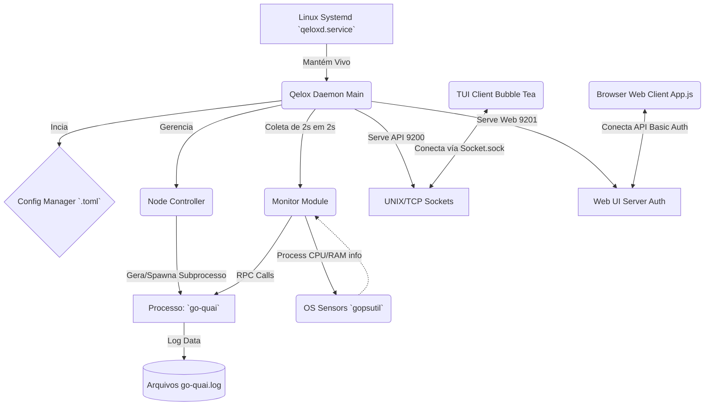
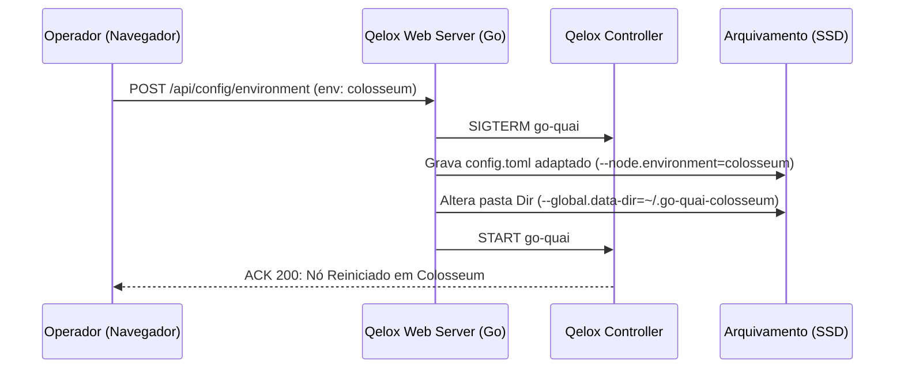

# Relatório de Arquitetura e Engenharia do QELO-X

Data: 04 de Março de 2026

## 1. Visão Geral (SaaS Node Operator)
O **QELO-X** evoluiu consideravelmente sua maturação para atuar como o principal proxy orquestrador para os nós da **Quai Network** (go-quai). Diferentemente de meros scripts em bash, este software foi portado plenamente para a linguagem Go (Golang), garantindo:

*   **Thread Safety:** Com controle refinado via Mutex na orquestração dos subprocessos, evitamos vazamento de memória e file descriptors.
*   **Acesso Múltiplo Transparente:** As bibliotecas do núcleo provém dados semáforos, permitindo que a visualização na interface TUI (Terminal) e interface Web (HTTP Dashboard) operem de forma limpa e paralela.

---

## 2. Diagrama da Arquitetura Cérebro-Espinhal

O fluxo operacional entre o System Daemon, os coletores de telemetria e a camada de apresentação gráfica pode ser modelado abaixo:

---

## 3. Lógica de Saúde do Nó (Health Score)

Uma das métricas centrais do projeto na versão SaaS para Operadores é o inovador monitoramento *Health Score* agregado ao alerta dinâmico de conexões ponto-a-ponto (*Low Peer Count*).

### Especificações do Escopo Matemático:
O sistema processa (via `internal/monitor/monitor.go`) uma análise da saúde do motor do nó:

1. **Estado do Motor**
   - Caso o estado da máquina de estado do Controlador seja diferento de RUNNING (Start, Stop, Crash), a Saúde é forçada para `0%`.
   - Se o Módulo de Monitoramento acusar que não houveram *Appending Blocks* em um espaço de tempo (`Frozen = true`), a Saúde é forçada para `0%`.

2. **Cálculos Baseados na Qualidade**
   - Se estiver online e processando os blocos, o nó atinge pontuação base = `100`.
   - **Peers Assessment (Tolerância P2P):** É checada a quantidade bruta de conexões estabelidas em nível Kernel (`TCP Sockets`). Subtrai-se em `3 pontos` por cada *socket* faltando abaixo do índice seguro (Configurado de forma customizável em `min_peers = 10`). 
   - **Recursos Máquina:** Subtrai `-10 pts` para picos maiores que 90% em RAM ou CPU, e `-20 pts` caso o SSD/HDD ultrapasse 95% de estresse (A Quai demanda espaço considerável).

---

## 4. O Mecanismo Automático de Ambiente (Smart Routing)

Para facilitar a comutação das cadeias ativas na Rede de Testes da Quai, injetamos fluxos de reinício controlado no endpoint `/api/config/environment`. Ao engatilhar, o Go (Sem precisar matar o orquestrador primário systemd):
- Envia o sinal `SIGTERM` orgânico e seguro ao nó respectável.
- Varre o arquivo local do usuário modificando a linha `--node.environment=` para a variante requesitada (`colosseum`, `garden`, `orchard` ou `cyprus`).
- Cria e remaneja automaticamente a pasta *Chain Data Dir* (`~/.go-quai-ambiente`) para nunca corromper ou misturar arquivos DB de cadeias distintas.
- Reinicia o fluxo de Start automaticamente.

---

## 5. Capturas de Tela Recomendadas (Apresentação SaaS)

*Devido à limitação do texto em PDF, recomendamos injetar (pós-renderização) nas páginas finais imagens destas seções na tela viva:*

1. **Top Dashboard Web Cards:** Apresentar a visão "Glassmorphism" com o Health Score Circular na cor verde e com os botões de controle de rede dinâmicos no Header.
2. **Terminal TUI View (`qelox tui`):** Uma imagem do Putty ou do ZSH processando o grid Dual-Column da TUI escrita utilizando Charmbracelet BubbleTea.

**Autor do Sumário Tecnológico**: Agentic System.
