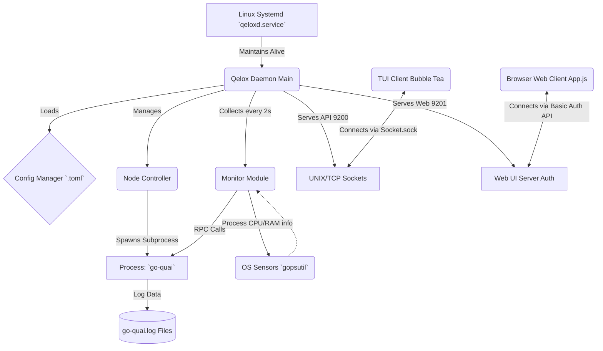
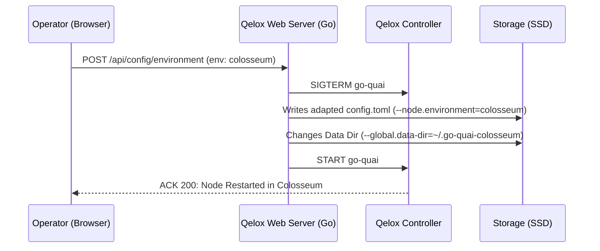

# QELO-X Architecture and Engineering Report

Date: March 04, 2026

## 1. Overview (SaaS Node Operator)
**QELO-X** has matured into the primary orchestrator proxy for **Quai Network** nodes (go-quai). Far beyond simple bash scripts, this software is fully ported to Go (Golang), ensuring:

*   **Thread Safety:** Refined control via Mutexes in subprocess orchestration prevents memory and file descriptor leaks.
*   **Transparent Multi-Access:** Core libraries provide semaphore data, allowing the TUI (Terminal) and Web Dashboard interfaces to operate cleanly in parallel.

---

## 2. Core Architecture Diagram

The operational flow between the System Daemon, telemetry collectors, and the graphical presentation layer is modeled below:

---

## 3. Node Health Logic (Health Score)

A central feature of the SaaS version for Operators is the innovative *Health Score* monitoring aggregated with the dynamic *Low Peer Count* alert.

### Mathematical Scope Specifications:
The system calculates health (via `internal/monitor/monitor.go`) based on an analysis of the node engine:

1. **Engine State**
   - If the Controller state machine is not RUNNING (e.g., Start, Stop, Crash), Health is forced to `0%`.
   - If the Monitoring Module detects no *Appending Blocks* over time (`Frozen == true`), Health is forced to `0%`.

2. **Quality-Based Calculations**
   - If online and syncing blocks, the base score starts at `100`.
   - **P2P Assessment (Connection Tolerance):** Raw established connections are checked at the Kernel level (`TCP Sockets`). `3 points` are subtracted for each missing socket below the safe index (Customizable via `min_peers = 10`).
   - **System Resources:** Subtractions of `-10 pts` for CPU/RAM spikes above 90%, and `-20 pts` if SSD/HDD stress exceeds 95% (Quai demands significant storage).

---

## 4. Smart Environment Routing

To facilitate switching between Quai Testnet chains, we injected controlled restart flows into the `/api/config/environment` endpoint. When triggered:
- Sends an organic `SIGTERM` signal to the node.
- Scans the local user file, modifying the `--node.environment=` line to the requested variant (`colosseum`, `garden`, `orchard`, or `cyprus`).
- Automatically creates and reassigns the *Chain Data Dir* (`~/.go-quai-env`) to prevent corruption or mixing DB files from different chains.
- Restarts the Start flow automatically.

---

## 5. UI Presentation

The project provides two primary interfaces for real-time monitoring:

1. **Web Dashboard:** A modern "Glassmorphism" UI with a circular Health Score and dynamic network control buttons.
2. **Terminal UI (TUI):** A dual-column terminal dashboard built with Charmbracelet Bubble Tea, perfect for remote SSH monitoring.

**Technical Summary Author**: Agentic System.
